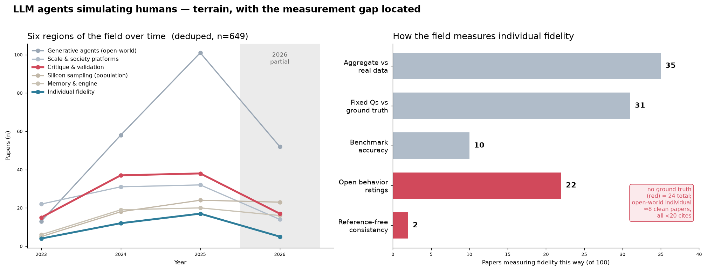
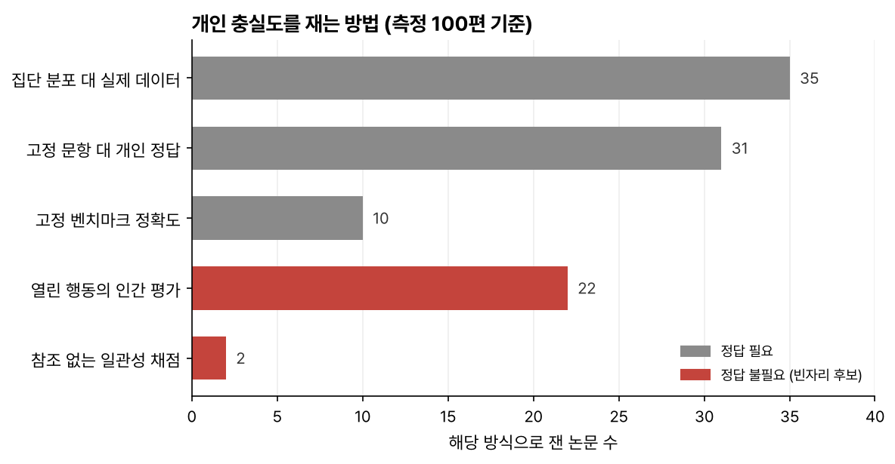

> 상태: 지도의 지역 분류는 제목·초록 수준의 자동 분류(2026-07 조사)다. 질문에 가장 가까이 간 8편 중 5편은 전문 정독으로 판정했고 3편은 유보. 랜드마크 28편은 전편 전문 정독을 마쳤고 본문 반영은 순차 진행 중이다.

인간과 AI가 섞여 상호작용하는 사회, 합성사회를 공부한다: 핵심 논문 2개 중심으로, 649편 자동 조사로 그린 분야 지도.

```{mermaid}
flowchart LR
    A["핵심 논문 계보<br/>Park 2023 · Park 2024"] --> B["자동 조사 649편<br/>여섯 지역 지도"]
    B --> C["8편 정독<br/>온전 충족은 확인 안 됨"]
    C --> D["처음 질문<br/>정답 없는 열린 세계의<br/>개인 충실도 측정"]
```

## 핵심 논문 계보 — Park 2023 → Park 2024

- **[Generative Agents](../paper-reviews/2304.03442-generative-agents.qmd)(Park 2023, 스몰빌)** — 분야의 시조. 기억을 시간순으로 쌓고(memory stream), 관련 기억만 골라 넣고(검색), 그 위에서 결론을 종합하고(reflection), 하루를 계획하는(planning) 구조로 마을 25명의 그럴듯한 일상을 만들었다. 단 닫힌 시뮬레이션이라 비교할 정답이 없고 그래서 측정한 것은 "맞다"가 아니라 "그럴듯하다"(believability)다.
- **[Park 2024](../paper-reviews/2411.10109-self-report-agents.qmd)** — 같은 1저자의 후속. 실제 사람 1,052명을 각자 2시간 인터뷰로 떠서 개인 단위로 시뮬레이션했다. 비로소 정답이 생겼지만 그 정답도 흔들린다. 같은 설문을 2주 뒤 다시 물으면 본인도 답이 달라진다. 그래서 본인의 자기일관성을 천장으로 놓고 채점했다. 대신 이 측정은 고정 문항과 미리 측정된 정답을 전제한다.

## 처음 잡은 질문

계보 전체가 닫힌 질문 위에서 움직인다. 고정 설문과 미리 측정된 정답 안에서는 채점이 되지만 자유형·실시간 상호작용에서 개인 충실도(AI로 만든 개인이 그 사람답게 행동하는 정도)를 측정하는 방법은 보이지 않았다. 그래서 처음 질문을 이렇게 잡았다.

**정답이 없는 열린 세계에서, AI로 만든 개인이 "그 사람답게" 행동하는지를 어떻게 측정할 것인가?**

엔지니어링 순서로는 닫힌 시뮬레이션이 먼저고 사람 투입이 그다음이다. 닫힌 공간 재현이 통제가 쉽기 때문이다. 그러나 이 공부의 핵심은 닫힌 세계를 다시 만드는 데 있지 않다. 실제 사람이 들어오면 기존의 고정된 측정 방법이 통하지 않게 되면서 생기는 문제들을 해결하려는 시도다.

닫힌 세계에도 아직 해결되지 않은 문제가 있다. Generative Agents는 마을에 소문이 퍼지고 관계가 맺어지는 걸 보여줬지만 그게 설계가 일으킨 것인지 아니면 에이전트 여럿을 며칠 두면 자연스럽게 나오는 것인지는 정확히 측정하지 못했다. 그럴듯한 시연과 입증 사이의 이 간극을 측정과 재현으로 메우는 것이 닫힌 세계에서의 첫 단계다. 그 위에 실제 사람이 들어오면 확인할 정답 자체가 흔들리는 문제가 새로 생긴다(같은 사람도 2주 뒤엔 답이 달라진다). "사람을 넣는다"는 건 공짜로 얻는 2단계가 아니라 더 어려운 문제의 시작이다.

"측정하는 방법이 보이지 않는다"는 주장은 반례 한 편이면 무너진다. 그래서 관련 논문을 자동 조사로 폭넓게 훑었다. Park 2023/2024를 기준으로 649편을 수집해 여섯 지역으로 분류한 것이 아래 지도다.

## 분야 지도 — 649편, 여섯 지역 {#field-map}

학술 데이터베이스(OpenAlex)에서 수집·검증한 649편(중복 제거) 코퍼스(논문 묶음)를 키워드 클러스터 대신 여섯 지역의 계보로 나누고 무엇을 어떻게 측정하는가라는 축 하나를 얹어 그렸다(측정축의 결과는 [핵심 판정](#gap-judgment)). 목적: 지금 쫓는 질문이 분야 어디에 있는지 확인하고 다음에 무엇을 깊게 읽을지 정하는 판단 근거. 최대 지역은 오픈월드 생성 에이전트(224편)고 지금 쫓는 질문이 있는 개인 충실도(38편)는 가장 작은 지역이다.

| 지역 | 편수 | 비중 | 성격 |
|---|---|---|---|
| 생성 에이전트 (오픈월드) | 224 | 35% | 오픈월드에서 믿음직한 에이전트 — 분야의 뿌리이자 최대 지역 |
| 대규모 사회 시뮬레이션 | 99 | 15% | 수백~수백만 에이전트 사회 시뮬레이션 플랫폼 |
| 비판·검증 방법론 | 107 | 16% | 인간 재현 여부·평가 타당성을 따지는 비판/방법론 |
| 실리콘 샘플링 (집단) | 70 | 11% | LLM으로 설문·여론 집단 분포를 대리 |
| 기억·엔진 | 61 | 9% | 기억·반성·검색 등 엔진 구성요소 |
| 개인 충실도 | 38 | 6% | 특정 개인의 성격·기억을 충실히 재현 — 지금 쫓는 질문이 있는 곳 |
| _기타/미분류_ | 50 | 8% | 분류 경계 밖 |

(합계 649편. 분류 방법과 한계는 아래 부록에.)



### 여섯 지역의 구도

다섯 지역이 행동을 만들고 한 지역이 그것을 따진다. 지금 쫓는 질문은 그 사이의 점선에 있고 공부가 진행되면 다른 지역에서도 질문이 이어진다(각 지역 소개의 접점 줄이 그 후보다).

```{mermaid}
flowchart LR
    subgraph MAKE["행동을 만드는 다섯 지역"]
        C["생성 에이전트 (오픈월드)"]
        D["대규모 사회 시뮬레이션"]
        S["실리콘 샘플링 (집단)"]
        E["기억·엔진"]
        B["★ 개인 충실도 — 지금 쫓는 질문"]
    end
    subgraph JUDGE["행동을 따지는 지역"]
        V["비판·검증 방법론"]
    end
    B -. "정답 없는 열린 세계에서<br/>개인을 어떻게 측정하는가" .-> V
```

**생성 에이전트 (오픈월드) — 224편.** 기억·반성·계획을 갖춘 에이전트가 오픈월드에서 그럴듯한 사회적 행동을 만들 수 있는가를 묻는 지역. 여기서 오픈월드는 에이전트가 각본 없이 자유롭게 행동하는 환경이라는 뜻이다. 실제 인간이나 정답이 없다는 뜻의 닫힌 시뮬레이션과는 다른 축이라 스몰빌은 오픈월드이면서 닫힌 시뮬레이션이다. [Generative Agents](../paper-reviews/2304.03442-generative-agents.qmd)가 사실상 표준 틀이 됐다. 여러 개체가 상호작용할 때 개별 개체의 일관성·충실도를 분리해 측정하는 방법은 확인 범위 내에 없다. 이 연구의 질문과 직결되는 지점이다.

**대규모 사회 시뮬레이션 — 99편.** 다수의 에이전트를 사회·경제 규모로 묶었을 때 집단 동학이 어떻게 되는가를 묻는 지역. 아키텍처·인프라 분류는 정리됐지만 개별 에이전트 행동이 실제 인간 집단 패턴을 재현하는지의 타당성 검증은 열려 있다. 집단 수준 검증을 개인 단위 충실도 평가로 뒤집어 쓸 수 있는가가 이 연구와의 접점.

**비판·검증 방법론 — 107편.** 시뮬레이션이 인간 행동을 얼마나 신뢰성 있게 재현하며 그 평가 자체가 타당한가를 따지는 지역. 페르소나 부여만으로는 대표성이 개선되지 않고 집단 편향이 체계적으로 나타난다는 것까지는 정립됐다. 시뮬레이션을 실제 인간 행동의 대리로 쓸 조건과 검증 절차의 표준화는 열려 있다. 이 연구의 측정 방법론의 출발점이 되는 지역.

**실리콘 샘플링 (집단) — 70편.** LLM이 개별 인간이 아닌 인구 집단의 응답 분포를 대리할 수 있는가를 묻는 지역. 그럴듯한 응답에 체계적 편향이 동반된다는 것까지 확인됐다. 어떤 조건에서 대체가 유효한지는 미해결이다. 집단 분포 정합성과 개별 정체성 충실도는 다른 층위라는 게 이 연구와의 경계선.

**기억·엔진 — 61편.** 장기 상호작용에서 일관된 정체성과 경험을 어떻게 저장·검색·갱신하는가를 다루는 지역. 메모리 메커니즘 분류는 정립됐지만 실제 장기 일관성 확보는 열린 문제다. 특정 인간의 기억·성향을 시간에 걸쳐 재현하는 엔진 층으로 이 연구와 직결된다.

**개인 충실도 — 38편.** 특정 개인의 성격·말투·기억을 얼마나 일관되게 재현하는가를 묻는, 지금 쫓는 질문이 있는 지역. Character-LLM·RoleLLM이 정립된 축이고(두 편은 아래 8편 표에 있다) 역할극과 개인화의 개념적 경계·장기 일관성 평가는 열려 있다. 예측 불가능한 상황 전개 속에서 believability를 정량화할 표준 척도는 부재하다. 이 부재 주장은 [핵심 판정](#gap-judgment)에서 시험했다.

### 지역별 랜드마크 28편

각 지역의 기준점 논문 28편.

::: {.callout-note collapse="true" title="지역별 랜드마크 28편"}

| 지역 | 논문 | 연도 | arXiv |
|---|---|---|---|
| **생성 에이전트 (오픈월드)** | Park 2023: Generative Agents (Smallville) | 2023 | `2304.03442` |
|  | Concordia | 2023 | `2312.03664` |
|  | Lyfe Agents | 2023 | `2310.02172` |
|  | Affordable Generative Agents | 2024 | `2402.02053` |
| **대규모 사회 시뮬레이션** | OASIS (100만 에이전트) | 2024 | `2411.11581` |
|  | AgentSociety | 2025 | `2502.08691` |
|  | Project Sid | 2024 | `2411.00114` |
|  | S3 | 2023 | `2307.14984` |
|  | GenSim | 2024 | `2410.04360` |
|  | LLM archetypes | 2024 | `2409.10568` |
|  | SocioVerse | 2025 | `2504.10157` |
| **비판·검증 방법론** | Santurkar: Whose Opinions | 2023 | `2303.17548` |
|  | CoMPosT (캐리커처) | 2023 | `2310.11501` |
|  | Wang: LLMs harmfully flatten (Nature MI) | 2024 | `2402.01908` |
|  | LLM traders don't replicate | 2025 | `2502.15800` |
|  | Simulations require a boundary | 2025 | `2506.19806` |
|  | Hullman: validating LLM sims | 2026 | `2602.15785` |
| **실리콘 샘플링 (집단)** | Aher: Turing Experiments | 2022 | `2208.10264` |
|  | Argyle: Out of One, Many | 2022 | `2209.06899` |
|  | Horton: Homo Silicus | 2023 | `2301.07543` |
| **기억·엔진** | Reflexion | 2023 | `2303.11366` |
|  | MemoryBank | 2023 | `2305.10250` |
|  | CoALA | 2023 | `2309.02427` |
|  | MemGPT | 2023 | `2310.08560` |
|  | HippoRAG | 2024 | `2405.14831` |
|  | Mem0 | 2025 | `2504.19413` |
|  | A-MEM | 2025 | `2502.12110` |
| **개인 충실도** | Park 2024: Self-report agents | 2024 | `2411.10109` |

:::

## 핵심 판정 — "열린 세계, 정답 없는 개인 believability 측정"은 정말 비어 있나 {#gap-judgment}

처음 잡은 질문의 "확인된 빈자리" 주장을 전제하지 않고 개인 충실도·검증 지역 170편이 실제로 무엇을 어떻게 측정하는지 분류해 시험했다(2026-07 조사). 판정은 두 단계를 거쳤고 **두 단계의 결론이 달랐다.**

### 1차 — 초록 수준 분류 (170편 → 측정 100편)



정답이 필요 없는 24편을 자유형·다회전 상호작용에서 개인 충실도를 측정하는 것으로 좁히면 약 8편이 남는다. 1차 판정은 "완전히 비어 있진 않다, 정립된 표준의 부재다"였다.

### 2차 — 전문 정독 재판정 (8편 중 5편)

그러나 8편의 전문을 정독하자 판정이 뒤집혔다. 초록에서 정답 없이 측정하는 것처럼 보였던 논문들이 실제로는 대부분 참조 정보에 기대고 있었다: 참조 답변과 표현이 겹치는 정도를 재는 Rouge-L 채점(RoleLLM), "답변 불가"라는 사전 정의된 정답(You Always Get an Answer), 사전 프로필 정합성(Character-LLM), 인간 설문 분포 정렬(Conformity), 시나리오에 숨긴 사실(AI-LieDar). **전문을 확인한 5편 전부가 "정답 없음" 기준에서 ✕ 아니면 △다.** 남은 3편(PersonaGym · LLM Agents in Interaction · Virtual Personas)은 판정 유보다.

### 현재 판정

- **"정답 없음 × 개인 단위 × 열린 상호작용" 세 조건을 온전히 채우는 정립된 방법은 확인 범위 내 없다.** 초록 수준에서 잠깐 "8편 있다"로 보였던 것은 전문 정독에서 유지되지 않았다.
- **인접한 시도 8편은 실재한다**. 방법론이 제각각이고 어느 것도 표준 척도로 수렴하지 않았다. 이들은 반박 대상이 아니라 출발점으로 삼을 직접 선행연구다.
- **확인 범위는 이 코퍼스다.** 8편은 2026-07 조사 한 번이 좁힌 후보라 조사 검색어가 그은 경계 밖에서 답이 나올 수 있다.

### 질문에 가장 가까이 간 8편 (직접 선행연구)

| 논문 | 연도 | 인용 | 정답 없이? | 개인 단위? | 열린 상호작용? | 한 줄 성격 |
|---|---|---|:---:|:---:|:---:|---|
| Character-LLM: A Trainable Agent for Role-Playing | 2023 | 470 | △ | ○ | ○ | 인물별 개별 학습 후 인터뷰식 평가 — 단 사전 프로필 정합성 채점 |
| RoleLLM: Benchmarking, Eliciting, and Enhancing Role-Playing Abilities of Large Language Models | 2023 | 226 | ✕ | ○ | △ | 자유형 역할극처럼 보이나 참조 답변 대비 Rouge-L 채점 |
| "You Always Get an Answer" | 2025 | 32 | ✕ | △ | △ | 답변 불가 질문에 대한 페르소나 환각·수용률 측정 — "답 없음"이 정답인 구조 |
| LLM Agents in Interaction | 2024 | 42 | △ | △ | ○ | 성격 일관성·언어 정렬 측정 — 상호작용은 1턴 한방향 글쓰기 |
| Conformity, Confabulation, and Impersonation | 2024 | 4 | △ | ○ | △ | 다중 에이전트 토론에서 개인별 사전/사후 응답 추적 — 단 설문 분포로 선별 |
| AI-LieDar | 2024 | 34 | △ | △ | ○ | 멀티턴 개방 대화의 진실성 등급화 — 단 시나리오에 숨긴 사실 대비 판정 |
| PersonaGym: Evaluating Persona Agents and LLMs | 2024 | 94 | △ | △ | △ | 동적 평가 + LLM이 생성한 참조 예시로 채점하는 자동 지표(PersonaScore) |
| Virtual Personas for Language Models via an Anthology of Backstories | 2024 | 55 | ✕ | △ | △ | 생애 서사로 페르소나 조건화 — 단 평가는 설문 분포 대비 |

범례: ○=충족, △=불명/부분, ✕=미충족. 인용수는 Semantic Scholar(2026-07-17 조회), 연도는 첫 공개(arXiv) 기준. LLM Agents in Interaction·PersonaGym·Virtual Personas 3편의 판정은 확정 유보고 표의 기호는 잠정 판정이다. 특히 PersonaGym은 미리 존재하는 정답은 없지만 채점 순간마다 LLM이 참조 예시를 새로 생성해 대조하는 구조라(공식 코드 대조로 확인), "정답 없음"과 "정답을 그때그때 만듦" 사이 어디로 볼지 판정이 갈린 채 남아 있다.

### 두 번째 빈틈 — 비계 재검증

측정 방법 부재와 별개로 빈틈이 하나 더 있다. 분야 표준이 된 기억·반성·계획 비계(scaffolding, 모델 바깥에 덧대는 구조)는 2023년 모델 시대에 설계된 것이다. 모델이 강해질수록 단순한 에이전트와 복잡한 에이전트의 성능 격차가 0으로 수렴한다는 보고가 나왔고(Lita의 Agent Complexity Law, `2509.25873`, 코딩 도메인 한정) 언어 에이전트에는 여전히 인지 구조가 필요하다는 반대 관점도 있다(CoALA, `2309.02427`). 정작 Generative Agents의 비계 구성요소를 강한 현대 모델로 [ablation](../glossary.qmd#ablation)(구성요소를 하나씩 빼며 기여를 확인하는 실험) 재검증한 논문은 확인 범위 내 없다.

## 부록 · 조사 방법과 한계

- 수집: Park 2023/2024 인용 관계 + 주제 검색 10개 → 관련성 필터 → LLM 판정 + 도메인 오염 제거 3라운드 → 714편. 초록 1,186편 확보. 랜드마크 표와 8편 표의 arXiv ID는 실레코드와 대조해 확인했다.
- 중복 제거: OpenAlex가 프리프린트/출판판을 분리 저장해 생긴 동일 제목 중복 65건을 최다 인용 판만 남기고 병합 → 649편. 지역 비중·순위는 병합 전후 불변.
- 지역 분류: 제목·초록 기반 LLM 분류(6지역 + 기타) + 인용 신호 보정. 완벽하지 않다. 경계 논문 50편은 기타로 뺐고 분류 전체가 정독 검증 전이다.
- 인용수: 조사 원자료의 OpenAlex 인용수는 프리프린트/출판판 레코드 분리로 크게 과소집계될 수 있어(실측 PersonaGym 4 vs Semantic Scholar 91) 지역 편수·비중 통계에만 썼다. 본문 인용수는 8편 표에만 있다.
- 계보: 코퍼스가 Park 두 논문 중심이라 랜드마크 간 직접 인용 관계는 희소하게 관측됐다(3건). 지역 구도는 인용 그래프가 아니라 검증된 노드 + 알려진 분야 계보로 그렸다.
- 핵심 판정: 170편 초록 분류 → 후보 8편 → 전문 정독 재판정(5편, 위 핵심 판정). 두 단계 결론이 달랐다는 것 자체가 이 지도의 한계 규정이다: 초록 수준 분류는 방향 제시용이고 확정 판정은 정독에서만 나온다.
- 이 조사는 자동화 도구(LLM + OpenAlex API)로 만든 1차 지도다. 정독을 마친 부분부터 고쳐 넣고 있다.
