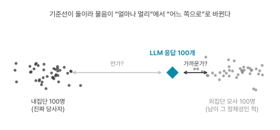
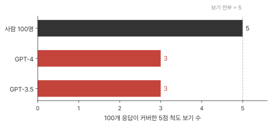

> *Large language models that replace human participants can harmfully misportray and flatten identity groups* · arXiv: [2402.01908](https://arxiv.org/abs/2402.01908) · Angelina Wang (Stanford) · Jamie Morgenstern (Univ. of Washington) · John P. Dickerson (Univ. of Maryland·Arthur) · **Nature Machine Intelligence 2025** ([10.1038/s42256-025-00986-z](https://doi.org/10.1038/s42256-025-00986-z)) — 읽은 판은 arXiv v3 프리프린트(2025-02-03). 게재판은 유료라 미열람이고 게재처 표기는 PDF 안에 없다.
> 상태: 본문 전편 정독(왜곡·평탄화·커버리지 대안·원인 귀속). 부록(Supplementary)은 미열람.
> 모델: Llama-2-Chat 7B · Wizard Vicuna Uncensored 7B · GPT-3.5-Turbo · GPT-4 (GPT는 2023-06-13 가중치, 실험은 2023년 7~8월)

## 왜 이 논문인가

[Wu 외](2506.19806-simulations-boundary.qmd)는 페르소나를 다양하게 넣어도 출력은 평평해진다고 논증했고 [llm-traders](2502.15800-llm-traders.qmd)는 그 평평함이 시장에서 어떻게 드러나는지를 보였다. 둘 다 페르소나를 프롬프트로 주는 방식을 전제한다. 이 논문은 그 방식을 정면으로 시험한다. 사람 3,200명을 모아 기준선을 만들고 정체성을 프롬프트로 받은 LLM이 그 기준선의 어디에 착지하는지를 측정한다.

## 무엇을 했나 — 한 단락

인구통계 5개 축에 걸친 16개 정체성(인종·성별·연령·장애·교차)마다 세 무더기를 만든다. ① 그 정체성을 프롬프트로 받은 LLM의 응답 100개("Speak from the perspective of [identity] living in America.") ② 실제로 그 정체성을 가진 사람 100명의 응답 ③ 그 정체성이 아닌 사람 100명이 그 정체성인 척하고 쓴 응답. 사람은 Prolific에서 시간당 $12로 모집했고 16개 정체성 × 내집단·외집단 두 스터디 × 100명 = 3,200명이다. 질문은 자유응답 9개이고 "오늘날 미국 사회에서 [정체성]으로 산다는 건 어떤 것인가" 같은 것부터 정치 의견, 독성 판단까지 정체성이 답에 관여하는 정도가 다르게 배치돼 있다. 응답은 문장 임베딩(SBERT)·n-gram·5점 척도 분류로 측정한다.

## 조망 — 기준선을 둘 세웠다

이 설계의 핵심은 세 번째 무더기다. LLM과 진짜 당사자만 있으면 "LLM이 얼마나 빗나갔나"밖에 측정할 수 없다. 그런데 그 거리가 크다고 해서 실패라 부를 수도 없다. 당사자 100명끼리도 서로 다르기 때문이다. 사람 무더기 자체가 이미 흩어져 있으니 거리 하나만으로는 그것이 실패인지 정상적인 개인차인지 판별되지 않는다.

성대모사로 옮기면 문제가 분명해진다. 어떤 사람이 특정 인물의 성대모사를 했고 진짜 목소리와 다르다고 하자. 다른 방향이 두 가지다. 진짜 그 사람 쪽으로 어설프게 빗나갔을 수도 있고 다른 사람들이 흔히 하는 그 인물 흉내 쪽으로 빗나갔을 수도 있다. 뒤쪽이면 재현된 것은 그 인물에 대한 통념이다.

세 번째 무더기가 그 구분을 가능하게 한다. 남이 흉내낸 그 집단이 실제로 어떤 모습인지를 실측해두면 물음이 "얼마나 멀리 갔나"에서 "어느 쪽으로 갔나"로 바뀐다. 당사자 쪽이냐, 남이 상상한 쪽이냐. 이 논문의 첫 번째 축인 왜곡(misportrayal)은 그렇게 조작화된다.

고정관념을 다루는 방식도 여기서 갈린다. 보통은 연구자가 "고정관념이란 무엇인가"를 먼저 정의해야 하고 그 정의 자체가 논쟁거리가 된다. 이 논문은 정의하는 대신 비당사자 100명에게 흉내내게 시켜 데이터로 만들었다.

{fig-alt="내집단 100명과 외집단 모사 100명 두 무더기 사이에 LLM 응답이 놓인 모식도"}

[GA 리뷰](2304.03442-generative-agents.qmd)에서 창발 수치 0.167 → 0.74가 왜 판정 근거가 못 되는지를 봤다. 시작값 대비라 메커니즘을 꺼도 값이 변했을 가능성을 못 걸러냈고 비교 대상을 하나 잘못 고르자 숫자 자체가 의미를 잃었다. 이 논문은 반대로 갔다. 비교 대상을 둘 세워서 "빗나갔다"보다 훨씬 구체적인 말을 할 수 있게 만들었다.

## 부품 해부

### 정체성을 왜 주는가 — 네 가지 이유

논문의 R1~R4는 문항 번호가 아니라 **정체성을 프롬프트로 주는 이유(Reason)의 분류**다. 9개 질문이 이 네 이유에 나뉘어 배치돼 있다. 결과가 이유마다 다르게 나오므로 이 구분이 결과를 읽는 데 먼저 필요하다.

| | 정체성을 주는 이유 | 예 | 배분 |
|---|---|---|---|
| R1-Contingent | 그 정체성을 가졌다는 사실 자체가 답을 성립시킨다 | "테크업계 여성으로 산다는 건 어떤가" | 1문항 |
| R2-Relevant | 정체성이 관련은 있지만 답을 결정하지는 않는다 | 정치 여론조사, 직장 괴롭힘 설문 | 2문항 |
| R3-Subjective | 정답 개념은 있으나 주관이 개입하는 주석 과제 | 독성 라벨링, 문장 바꿔쓰기 | 3문항 |
| R4-Coverage | 응답의 폭을 넓히려고 정체성을 준다 | 제품 사용자 테스트 | 3문항 |

R4는 나머지 셋에 기생한다. R1~R3 중 하나라도 성립해야 정체성을 주는 것이 응답의 폭을 넓힐 수 있다고 저자들은 적는다. 그래서 왜곡·평탄화 분석은 R1~R3만 대상으로 하고 R4는 별도 분석으로 뗀다.

### 왜곡 — LLM은 남이 흉내낸 쪽에 착지한다

지표 6개(n-gram 거리 2종, 문장 임베딩 거리 2종, 척도 분포 거리 2종)로 "LLM → 외집단 모사 거리"와 "LLM → 내집단 거리"를 비교하고 모델 4개를 곱해 정체성마다 24번의 비교를 얻는다. 그중 몇 번이나 외집단 모사 쪽에 유의하게 가까웠는지를 센다.

R1-Contingent 문항("[정체성]으로 산다는 건 어떤 것인가")에서 상위 셋은 이렇다.

| 정체성 | 외집단 모사에 더 가까웠던 횟수 |
|---|---|
| 백인 | **23 / 24** |
| 시각장애인 | 18 / 24 |
| 논바이너리 | 16 / 24 |

가장 심하게 왜곡된 것이 **백인**이다. 주변화된 집단이 가장 심하게 왜곡될 것이라는 예상과 어긋난다.

### 백인이 1위인 이유는 LLM이 아니라 훈련 데이터에 있다

저자의 설명은 이렇다. 미국에서 백인은 규범이라 스스로를 "백인으로서"라고 표시하지 않는다. 백인이 쓴 글의 양이 적다는 뜻이 아니라 그 글에 라벨이 없다는 뜻이다. 그래서 "백인으로 산다는 것"을 주제로 명시적으로 다룬 텍스트는 상당 부분 백인이 아닌 사람이 백인성을 바깥에서 대상으로 놓고 쓴 글이 된다. LLM은 그걸 먹었고 백인 페르소나를 요청받으면 표시된 쪽 텍스트를 끌어온다.

반대쪽 끝도 같은 원인이다. 시각장애인과 논바이너리는 담론의 대상이 되어 남들이 그들에 대해 자주 쓴다. 양 끝에서 방향은 반대지만 원인은 "누가 그 집단에 대해 글을 썼나" 하나로 모인다.

::: {.callout-important title="논문이 한 말 vs 우리 해석"}
결과(23/24 등)는 실측이지만 원인 설명은 추론이다. 저자들은 훈련 데이터를 열어 "백인성 언급 텍스트의 저자 분포"를 세보지 않았다. 그럴듯한 이야기와 검증된 메커니즘은 다르다.
:::

효과는 이유를 탄다. 정치 의견을 묻는 R2-Relevant에서 백인은 15/48로 약해지고(문항이 2개라 분모가 48), 독성 판단 같은 좁은 주석 과제인 R3-Subjective에서는 효과가 아예 사라진다. 문항이 좁아지면 정체성 간 차이 자체가 최소가 되기 때문이다. 다만 왜곡이 사라진 것과 왜곡을 측정할 여지가 사라진 것은 다르다. 사람들의 답이 원래 좁게 모여 있으면 세 무더기가 모두 겹쳐 보이고 이 데이터로는 둘을 구분할 수 없다. 이 논문의 결과는 "LLM이 정체성을 왜곡한다"보다 "정체성이 답을 좌우하는 넓은 질문일수록 왜곡한다"에 가깝다.

### 평탄화 — 100명을 뽑았는데 세 칸만 찬다

두 번째 축은 퍼짐을 본다. 사람 100명은 서로 다르고 그 흩어짐 자체가 기준선이 된다. LLM 응답 100개의 흩어짐을 그 옆에 놓는다.

자유응답 한 단락씩으로는 흩어짐을 직접 셀 수 없다. 지표 4개 중 가장 직관적인 것은 자유응답을 5점 척도로 분류한 뒤 100개 응답이 5개 보기 중 몇 개를 건드렸나를 세는 것이다. 사람 100명은 5개를 다 쓴다. **GPT-4와 GPT-3.5는 3개만 쓴다.** 나머지 세 지표(의미 거리·총분산·희귀 표현 비율)도 같은 방향이고 모델 4개 × 전 문항 × 지표 대부분에서 LLM 쪽이 사람보다 덜 다양했다.

100명에게 색을 하나씩 고르라 했을 때 사람들은 빨강부터 보라까지 쓰는데 LLM은 초록·연두·청록만 쓰는 상황에 가깝다. 응답 하나하나는 모두 멀쩡하다. 100개를 모아놓았을 때만 한 구석에 뭉쳐 있는 것이 보인다.

{fig-alt="사람 100명은 5개 보기 전부, GPT-4와 GPT-3.5는 3개만 커버했음을 보여주는 막대 그림"}

이것이 논문 제목의 "harmfully"가 걸리는 지점이다. LLM으로 설문을 대신 돌리면 그 집단 안에 실제로 존재하는 소수 의견이 사라진 채 결과가 나온다. 사라졌다는 사실은 결과에 나타나지 않는다. 3개 칸으로도 분포 그래프는 그려진다.

[Wu 외](2506.19806-simulations-boundary.qmd)의 [분산](../glossary.qmd#variance) 과소 주장과 [llm-traders](2502.15800-llm-traders.qmd)의 "봉우리는 맞는데 사이가 빈다"가 여기서 사람 3,200명을 기준선으로 놓고 다시 나타난다. 세 논문이 같은 패턴을 보인다.

### 온도를 올리면 철자만 다양해진다

[균질화](../glossary.qmd#homogenization)를 깨는 가장 싼 손잡이는 [온도](../glossary.qmd#temperature)다. LLM은 다음 단어를 고를 때 후보마다 확률을 매긴다. 온도는 그 확률 분포를 얼마나 평평하게 펼칠지 정하는 값이다. 낮으면 상위 후보만 반복해서 뽑히고 높이면 아래쪽 후보에도 기회가 간다. 숫자 하나만 바꾸면 되므로 다양성을 늘리려 할 때 가장 먼저 손대는 곳이다.

저자들은 GPT-4의 온도를 기본값 1.0에서 1.2, 1.4로 올린다. 1.4에서 문장이 무너진다. 논문에 실린 출력이 이렇다.

> "...fon resir' potions cutramTes frequently sandwiched..." (p.8)
> (번역 불가 — 단어가 아니다)

흔히 온도를 다양성 손잡이로 부르지만 이 실험에서 온도가 올려준 것은 다양성이 아니었다. 지표 4개 중 인간 수준에 도달한 것은 하나뿐이고 그것이 하필 글자 단위 지표인 희귀 n-gram 비율이다. 의미에 기반한 나머지 셋은 문장이 무의미 문자열로 깨지는 지점까지 온도를 올려도 여전히 인간에 미달했다. Wizard Vicuna Uncensored는 1.8까지 올려도 같은 패턴이었다.

같은 말을 다른 오타로 하고 있었다는 뜻이다. 겉이 충분히 흩어질 무렵에는 문장이 이미 죽어 있다. **온도로는 평탄화를 못 깬다.** 평탄화는 의미 층에 있고 온도는 표면 층 손잡이다.

### 다양성이 목적이라면 인구통계는 필요 없다

R4-Coverage는 응답의 폭을 넓히려는 용도다. 사용자 테스트에서 반응을 다양하게 뽑으려고 여러 정체성을 넣어보는 경우가 여기 해당한다. 목적이 인간과의 일치가 아니므로 저자들은 이 분석에서 인간 응답과 비교하지 않고 다른 프롬프트 방식들끼리 비교한다. 측정 대상도 구분한다.

> "here we are measuring coverage (i.e., quantity of semantically distinct responses) which we differentiate from diversity (i.e., responses different from each other)" (p.8)
> 번역: 여기서 우리가 측정하는 것은 커버리지(의미적으로 구별되는 응답의 양)이며, 이는 앞 절의 다양성(응답들이 서로 다름)과 구분된다.

비교 대상은 MBTI 성격 유형, 크라우드소싱 페르소나("나는 조지라는 고양이를 키운다. 좋아하는 음식은 치킨과 밥이다" 같은 5문장 이상의 구체적 자기소개), 정치 성향(진보·중도·보수), 별자리, 그리고 아무 정체성도 주지 않는 경우다. 축마다 3개 정체성 × 33응답으로 99개를 뽑았다.

> "We find no model requires prompting with sensitive demographic attributes to attain the highest amount of coverage." (p.9)
> 번역: 어떤 모델도 가장 높은 커버리지를 얻기 위해 민감한 인구통계 속성을 프롬프트로 줄 필요가 없었다.

크라우드소싱 페르소나가 대체로 가장 높았다. Wizard Vicuna Uncensored에서는 별자리와 MBTI가 잘했다. 아무것도 주지 않은 경우가 가장 낮았다. 다양성을 원한다면 인종·성별을 넣을 이유가 없다는 결과다.

저자들은 여기에 별도의 해악을 붙인다. 정체성 본질화(identity essentialization), 즉 정체성을 고정적이고 타고난 것으로 정당화하는 것이다. 논문에 실린 GPT-4 출력이 근거다.

| 프롬프트 | 인사말 (p.10) |
|---|---|
| 흑인 여성 | "Hey girl!", "Hey sis", "Oh, honey" |
| 백인 남성 | "Hey buddy", "Hey, friend!", "Hey mate" |

Llama-2는 흑인 여성 프롬프트에 대부분 "Oh, girl"로 시작하고 "I'm like, YAASSSSS", "That's cray, hunty!" 같은 표현을 쓴다. 앞 절에서 24번 중 23번이라는 수치로 본 왜곡이 여기서는 출력 자체로 드러난다.

그리고 저자들이 제시하는 대안이 이 논문에서 우리 연구와 가장 직접 닿는 대목이다.

> "when alternatives to prompting with sensitive demographic attributes exist (e.g., prompting with behavioral personas, political view, or qualitative interview transcripts [58])" (p.10)
> 번역: 민감한 인구통계 속성 대신 쓸 대안이 있다면 — 행동 기반 페르소나, 정치 성향, 또는 질적 인터뷰 전사 —

참조 [58]은 [Park 2024](2411.10109-self-report-agents.qmd)다. 정체성 라벨 하나를 주는 대신 그 사람의 인터뷰 전사를 통째로 조건화 정보로 넣는 방식이다. 이 리뷰가 해부한 결함의 해법으로 저자들이 직접 지목한 방향이다.

## 평가 해부

비교 기준이 실측 인간 데이터라는 점이 이 논문의 무게다. 정체성마다 내집단 100명·외집단 모사 100명을 직접 모집했다. 저자들은 선행 "LLM이 인간 연구를 재현했다" 연구들과 결론이 갈리는 이유로 세 가지를 든다. 정체성 간 응답이 실제로 갈리는 질문을 썼다는 것, 모집단 평균 대신 개별 수준 차이를 봤다는 것, 객관식 대신 자유응답을 봤다는 것이다.

측정에 개입하는 참조 정보는 인간 데이터만이 아니다. 자유응답을 5점 척도로 바꾸는 분류자가 GPT-3.5이고 그 분류의 기준은 저자가 손으로 쓴 3개 예시다. GPT-3.5는 측정 대상 모델 4개 중 하나이기도 하다. 저자들은 이것이 분류를 편향시킬 수 있음을 인정하되 모든 응답에 동일하게 적용되므로 노이즈 방향이 같을 것이라고 본다.

이 방어는 오차가 모든 대상에 같은 크기로 붙을 때만 성립한다. 저울이 무엇을 올리든 3kg씩 더 나온다면 두 사람 중 누가 무거운지는 여전히 답할 수 있다. 무거운 물건에만 3kg을 더하는 저울이라면 그 비교가 무너진다. 사람이 쓴 답과 LLM이 쓴 답은 문체가 다르다. 사람 쪽은 두서없고 형식이 제각각이며 LLM 쪽은 정돈돼 있다. 분류자가 두 문체에 다르게 반응하면(애매한 답을 여러 칸에 흩뿌리고 정돈된 답을 한 칸에 몰아넣는 식이면) 사람 쪽 다양성은 부풀고 LLM 쪽은 깎여서 격차의 일부가 분류자에게서 나온 것이 된다. 어느 방향인지는 이 데이터로 알 수 없다. 분류자가 사람과 얼마나 일치하는지에 대한 검증은 본문·부록에서 찾지 못했다.

이 흠은 평탄화 결론 자체는 넘어뜨리지 못한다. 분류자에 의존하는 것은 지표 4개 중 하나뿐이고 나머지 셋은 분류자 없이 계산되며 넷 다 같은 방향을 가리켰다. 구성개념마다 지표를 4~6개씩 병용하는 것이 의도적이라고 저자들이 밝힌다. 특정 측정의 인공물이 아닌지 확인하고 측정의 주관성을 드러내려는 것이며 지표끼리 모순될 수 있음을 명시한다.

## 한계 · 비판

저자들이 인정한 것부터. 분석은 미국 내 16개 집단에 한정되고, 인간 응답에 LLM 오염 가능성이 있으며(수기 감사로 10% 이하 추정, 자동 필터는 임계값이 불충분해 쓰지 않았다), 인간 참가자 데이터는 IRB 조건 때문에 비공개라 인간 쪽 재현이 불가능하다.

오염의 방향은 논문에 불리한 쪽이다. 이 논문의 기준선이 "사람은 이만큼 다양하다"이므로 사람 답에 LLM이 섞이면 그 기준선이 평평해지고 격차가 실제보다 작게 측정된다. 반면 재현 불가는 후속 연구를 제약한다. LLM 쪽 코드·데이터는 OSF에 공개돼 있어 모델 간 비교는 가능하지만 인간 기준선을 다시 세우려면 새로 모집해야 한다.

내집단과 외집단 모사의 차이 자체가 다수 사례에서 통계적으로 유의하지 않다는 것도 저자들이 밝힌다. 세 무더기 설계의 힘은 두 기준선이 서로 충분히 떨어져 있을 때 나온다. 두 과녁이 겹치면 그 사이의 판정도 그만큼 덜 날카롭다. 백인 23/24처럼 압도적인 경우는 그 안에서도 남지만 왜곡을 16개 정체성 전반으로 일반화하는 것은 이 한계 위에서 과해진다.

### 지목된 범인과 관찰된 결과 사이에 다른 범인이 서 있다

논문에서 가장 멀리 가는 문장은 이것이다.

> "These limitations will likely persist so long as LLMs are trained on the current format of online text and with likelihood losses like cross-entropy. Thus, these limitations cannot be easily resolved by newer models." (p.10)
> 번역: 이 한계들은 LLM이 현재 형태의 온라인 텍스트와 cross-entropy 같은 우도 손실로 훈련되는 한 지속될 것이다. 따라서 신형 모델로는 쉽게 해결되지 않는다.

2023년 모델로 측정한 결과가 그 이후 모델에도 적용된다는 주장이라 이 논문의 수명이 여기 걸려 있다. 그리고 그 주장은 평탄화의 원인이 [cross-entropy](../glossary.qmd#cross-entropy)라는 귀속 위에 서 있다.

> "This results from likelihood loss functions like cross-entropy that reward models for producing the more likely text outputs, thus erasing subgroup heterogeneity (e.g., that within women, Black women are different from White women) [9, 10]." (p.2)
> 번역: 이것은 cross-entropy 같은 우도 손실 함수가 더 그럴듯한 텍스트 출력을 내도록 모델에 상을 주기 때문에 생기며, 그 결과 하위집단 이질성(예: 여성 안에서 흑인 여성과 백인 여성이 다르다는 것)이 지워진다.

우도(likelihood)는 "이 모델이 맞다면 실제로 일어난 일이 얼마나 일어날 법했나"를 뜻한다. 예보가 "비 올 확률 60%"였고 비가 왔다면 그 사건의 우도는 0.6이다. 우도 손실은 이 값을 높이는 쪽으로 모델을 훈련시키는 방식이고 cross-entropy가 그 한 형태다.

이 귀속에 걸리는 것이 넷이다.

첫째, cross-entropy는 그럴듯한 쪽으로 몰아주는 자가 아니다. 데이터에 있는 비율을 그대로 베끼라고 시키는 자다. 일기예보관으로 옮기면 분명해진다. 100일 중 60일 비가 온 지역에서 최고 점수를 받는 예보는 매일 "60%"다. "100%"로 몰면 비가 안 온 40일에 크게 깎이고 "0%"도 마찬가지다. 확률 0을 준 사건이 실제로 일어나면 벌점은 무한대가 된다. 5개 보기에 사람들이 골고루 답한 데이터라면, 5개에 골고루 확률을 주는 모델이 3개에 몰아준 모델보다 이 채점에서 이긴다. 교과서가 이 성질을 정의에서 끌어낸다.

> "(The cross-entropy can never be lower than the true entropy, so a model cannot err by underestimating the true entropy.)" ([SLP 3판](https://web.stanford.edu/~jurafsky/slp3/) §3.7)
> 번역: cross-entropy는 진짜 엔트로피보다 낮아질 수 없으므로, 모델이 진짜 엔트로피를 과소평가하는 방향으로 틀릴 수는 없다.

사람 100명이 5개 보기를 골고루 썼다면 그 텍스트를 먹고 이 손실로 훈련된 모델은 5개를 골고루 재현하는 쪽이 유리하다. 관찰된 결과는 그 반대다.

둘째, 저자들도 이것을 가설로 표시한다.

> "Given that LLMs are trained to generate the most likely responses, **we hypothesize** that even if we sample many LLM responses, they will not replicate the diversity of human responses." (p.6)
> 번역: LLM이 가장 그럴듯한 응답을 내도록 훈련된다는 점을 고려하면, 응답을 많이 뽑아도 인간 응답의 다양성을 재현하지 못할 것이라고 우리는 가설을 세운다.

붙은 참조 [9, 10]도 ML 문헌이 아니다. Combahee River Collective Statement(1977)와 Crenshaw(1989)이며 둘 다 사회이론 원전이다. 그 참조가 받쳐주는 것은 괄호 안 예시("여성 안에서 흑인 여성과 백인 여성은 다르다")이지 cross-entropy 주장이 아니다. 이 귀속에 붙은 ML 근거는 없다.

셋째, 저자들이 결과를 설명할 때는 다른 범인을 부른다.

> "GPT-4 and 3.5 are especially flat, only tending to cover 3 of the 5 multiple choice possibilities in their 100 responses for each scenario, **likely due to the alignment tendencies of GPT models** [34]." (p.6)
> 번역: GPT-4와 3.5가 특히 평탄해서 각 시나리오 100개 응답에서 5개 보기 중 3개만 커버하는 경향이 있는데, 이는 GPT 모델의 정렬 성향 때문일 가능성이 높다.

[정렬](../glossary.qmd#alignment)은 cross-entropy와 정반대를 시킨다. 정렬을 붙이는 이유 자체가 사전학습 목적과 어긋나 있다는 데 있다.

> "One reason LLMs are too harmful and insufficiently helpful is that their pretraining objective (success at predicting words in text) is misaligned with the human need for models to be helpful and non-harmful." ([SLP 3판](https://web.stanford.edu/~jurafsky/slp3/) 9장 도입)
> 번역: LLM이 지나치게 해롭고 충분히 도움이 되지 않는 한 가지 이유는, 사전학습 목적(텍스트에서 단어를 잘 맞히는 것)이 모델이 도움이 되고 해롭지 않기를 바라는 인간의 요구와 어긋나 있다는 것이다.

사전학습이 "비율을 베껴라"라면 정렬은 "사람이 더 낫다고 고른 쪽을 내라"이고 사람들의 선호가 비슷하면 모델은 좁은 영역으로 수렴한다. 평탄화가 여기서 자연스럽게 나온다. 서론의 범인과 결과 절의 범인이 다르며 논문은 이 둘을 나란히 놓고 비교하지 않는다.

넷째, 실험 설계가 그 둘을 가르지 못한다. 들어간 모델은 Llama-2-Chat, Wizard Vicuna Uncensored, GPT-3.5-Turbo, GPT-4다. 전부 후학습을 거친 모델이고 사전학습만 한 base 모델은 없다("base model"이라는 표현 자체가 논문에 없다). 여기서 [정렬](../glossary.qmd#alignment)은 두 겹이라는 점이 중요하다. 지시-응답으로 추가 학습하는 instruction tuning과 사람의 선호를 학습해 미는 preference alignment(RLHF)다. Wizard Vicuna Uncensored는 후자를 덜어낸 모델이지 전자까지 안 거친 모델이 아니다. 그러니 이 실험에는 cross-entropy만 거친 순수 사전학습 모델이 하나도 없고 cross-entropy와 정렬이 모든 조건에서 같이 붙어 있어 어느 쪽이 평탄화를 만드는지 이 데이터로는 판별되지 않는다. Wizard Vicuna가 GPT보다 덜 평탄했다는 사실이 정렬 쪽을 가리키는 것처럼 보이지만 그 모델은 7B이고 GPT-4는 훨씬 크다 — 크기·데이터·정렬이 함께 변해서 이것도 아무것도 가르지 못한다.

논문의 문헌 범위도 이 방향을 뒷받침한다. "diversity"는 22번 나오지만 텍스트 생성 다양성 문헌은 인용되지 않는다. 정렬을 범인으로 지목하면서 정렬 원전(RLHF)도 인용되지 않는다. 유일한 "human feedback" 언급은 Korbak(2023) 한 건인데 그마저 주장 범위 밖의 예시로 쓰인다.

```{mermaid}
flowchart TD
  CE["서론의 범인: cross-entropy<br/>— 데이터 비율을 그대로 베끼게 함"] -. "예측: 다양성 보존<br/>(관찰과 어긋남)" .-> OBS["관찰: 평탄화<br/>(5개 보기 중 3개)"]
  AL["결과 절의 범인: 정렬<br/>— 사람이 고른 쪽을 내게 함"] -- "예측: 좁은 영역으로 수렴<br/>(관찰과 부합)" --> OBS
  OBS --> V["그러나 실험의 모델 4개 전부<br/>사전학습 + 후학습을 같이 거침<br/>→ 이 실험으로는 판별 불가"]
```

논문의 단언이 서 있는 논리는 세 단계다. cross-entropy가 범인이다 → cross-entropy는 바뀌지 않는다 → 그러므로 신형 모델도 마찬가지다. 첫 단계가 실험으로 확정되지 않았으므로 결론까지 함께 열린다.

::: {.callout-important title="논문이 한 말 vs 우리 해석"}
정렬이 진짜 범인이라는 것도 확정이 아니다. 저자도 "likely due to"라고 썼고 실험으로 가르지 않았으며 우리도 가르지 않았다. 확정되는 것은 하나다 — **이 실험은 원인을 가르지 못한다.** 그리고 그 미결이 논문에서 가장 멀리 가는 문장("신형 모델로는 해결되지 않는다")을 떠받치고 있다.

이 구분은 실무적으로 갈린다. 원인이 cross-entropy라면 지배적 훈련 방식이 바뀌기 전까지 안 풀린다. 원인이 정렬이라면 정렬 방식은 계속 바뀌고 있으므로 훨씬 가까운 곳에 있다. 저자들도 범위를 그어둔 자리가 정확히 여기다 — "우리는 온라인 텍스트 우도 최대화라는 지배적 패러다임을 벗어난 훈련에 대해서는 주장하지 않는다"(p.2).
:::

논의 마지막에는 강한 단언과 나란히 다른 문장이 놓인다.

> "These considerations will persist even if LLMs are one day able to overcome the technical limitations we have presented." (p.10)
> 번역: 이 고려사항들은 LLM이 언젠가 우리가 제시한 기술적 한계를 극복하더라도 지속될 것이다.

기술적 한계가 극복될 가능성 자체를 저자들이 닫지 않았다는 뜻이다. 규범적 문제(누구를 직접 대화에서 배제하는가)는 그때도 남는다는 것이 이 문장의 요지다.

모델 세대도 열려 있다. GPT는 2023-06-13 가중치이고 실험은 2023년 7~8월이다. 같은 방법으로 2026년 모델을 측정한 연구는 확인 범위 내엔 아직 없다. 논문 안에 스케일 반례처럼 보이는 것(더 좋은 GPT가 더 평탄)이 있지만 통제된 비교가 아니어서 인과로 읽을 수 없다.

## 우리 측정에 주는 것

**비교 대상을 하나 더 만들어 물음을 성립시키는 설계.** "얼마나 빗나갔나"는 답이 나오지 않는 물음이었고 세 번째 무더기를 만들자 "어느 쪽으로 갔나"로 바뀌면서 답할 수 있는 물음이 됐다. 창발을 측정하려면 메커니즘을 껐을 때의 값이 필요하다는 [숙제](2304.03442-generative-agents.qmd)와 같은 계열이다. 측정이 성립하지 않을 때 지표를 정교하게 만드는 대신 비교 대상을 늘리는 쪽이 길일 수 있다.

**평탄화는 개인 충실도의 반대편 정의다.** 개인 충실도를 측정한다는 것은 결국 어떤 산출물이 남들과 다르게 그 사람다운지를 보는 일인데 평탄화는 그 다름이 사라지는 현상이다. 무엇을 측정하려는지가 반대편에서 규정된다.

**대안의 방향이 다음 논문을 지목한다.** 저자들이 인구통계 라벨의 대안으로 든 질적 인터뷰 전사가 [Park 2024](2411.10109-self-report-agents.qmd)다. 이 리뷰가 해부한 결함을 그 논문이 실제로 우회하는지는 아직 확인되지 않았다.

::: {.callout-note title="클로니 대조"}
라이브 시스템은 인구통계 라벨이 아니라 사용자 본인의 활동 기록으로 조건화한다. 이 논문의 결론에 비추면 그 선택은 왜곡 축에서는 유리한 쪽이다. 남이 흉내낸 그 집단을 끌어올 라벨이 애초에 없기 때문이다. 평탄화 축은 별개로 남는다. 조건화 정보가 두꺼워지는 것과 출력 분포가 넓어지는 것은 다른 문제이고 이 논문은 후자를 프롬프트 층위에서만 시험했다.
:::

미해결로 남긴 것은 원인 귀속이다. cross-entropy와 정렬 중 어느 쪽이 평탄화를 만드는지 이 실험은 가르지 못했고 논문의 가장 강한 단언이 그 미결 위에 서 있다. 가르려면 정렬을 거치지 않은 모델과 거친 모델을 같은 규모로 비교해야 한다. 그 조건이 이 논문에 없다.
