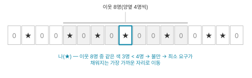
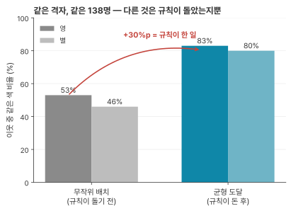

> Thomas C. Schelling, "Dynamic Models of Segregation", *Journal of Mathematical Sociology* 1971, Vol. 1, pp. 143–186 (DOI [10.1080/0022250X.1971.9989794](https://doi.org/10.1080/0022250X.1971.9989794)) · 인용 4,738회(Semantic Scholar, 2026-07-17 조회)
> 상태: 두 모델(공간 근접·경계 지정) 정독. 티핑 절은 두 모델의 관계를 다룬 대목만 읽었다.
> 방법: 손과 눈으로 한 시뮬레이션. 컴퓨터를 쓰지 않았고 저자는 이동 순서의 엄격한 규칙을 지키지 않았다고 밝힌다(p.155).

## 왜 이 논문인가

창발(emergence)의 사회과학 쪽 원전이고 행위자 기반 모델(agent-based model)의 원조로 통한다. 저자는 컴퓨터 없이 동전과 모눈종이로 이 모델을 돌렸고 이후 Epstein과 Axtell이 이 발상을 전산화해 *Growing Artificial Societies*로 이었다.

이 공부에서의 자리는 다른 데 있다. 분야의 시조 Generative Agents(Park 2023, LLM 에이전트 25명을 가상 마을에 풀어놓은 논문)는 "창발적 사회 행동"을 관측했다고 보고한다. 그런데 그 논문 전문에 Schelling은 한 번도 나오지 않는다. Epstein·Axtell·Sugarscape·Holland·셀룰러 오토마타 같은 복잡계 계보도 검색되지 않는다. GA가 쓰는 emergent의 정의는 §3.4의 한 문장이 전부다: "emergent rather than pre-programmed"(미리 프로그래밍한 것이 아니라 창발한 것).

## 무엇을 했나 — 한 단락

분리(segregation)를 낳는 기제는 여럿이다. 조직된 차별, 경제적 격차, 개인의 차별적 선택. 이 논문은 세 번째만 떼어내 추상 모델로 다룬다(p.144–145). 모델은 두 개다. 공간 근접 모델(spatial proximity model)에서는 각자가 자기 위치를 기준으로 이웃 구성을 보고 불만이면 자리를 옮긴다. 경계 지정 이웃 모델(bounded-neighborhood model)에서는 모두가 공유하는 구역 하나의 색 비율만 본다. 두 모델을 차례로 본다.

## 조망 — 5:4를 요구했더니 5:1이 나온다

선형 모델의 셋업은 이렇다(p.149–150).

- 70명(별 35, 영 35)이 일렬로 선다. 초기 배열은 난수표로 정한다.
- 이웃은 양옆 4명씩 총 8명이다.
- 규칙은 하나다. 이웃 8명 중 최소 4명이 자기 색이면 만족한다.
- 불만이면 최소 요구를 채우는 가장 가까운 자리로 가서 끼어든다.
- 아무도 남의 이동을 예측하지 않는다. "Nobody in this model anticipates the movements of others."(p.150)

{fig-alt="별과 영이 일렬로 선 칸들 가운데 초점 인물과 양옆 4명씩의 이웃 8명을 표시한 모식도"}

초기 불만은 26명이고 2라운드에 전원이 만족한다. 결과는 군집 6개(8·15·10·15·16·6명, 평균 12명)다. 이웃 540쌍 중 440쌍이 같은 색으로, **81.5%**다. 자기 자신을 아홉 번째 구성원으로 세면 평균 5:1이 넘는 동네에 살게 된다.

> "This resulted from individuals' *seeking* a ratio not less than five to four."(p.150)
> (이것은 각자가 5:4 이상의 비율을 추구한 결과다.)

여기가 흔히 미끄러지는 자리다. 정지 조건이 "8명 중 4명"이므로 전원이 멈춘 상태라면 전원이 최소 50%를 만족한다. 이것은 추론이 아니라 정의상 참이다. 그래서 결과도 50% 근처일 것 같지만 하한 50%와 평균 50%는 다른 값이다. 실제 평균은 81.5%다.

이동 규칙을 보면 간격이 더 벌어진다. 불만인 사람은 "최소 요구를 채우는 가장 가까운 자리"로 간다. 넘치는 자리를 노리지 않고 더 좋은 동네가 멀리 있어도 가지 않는다. 이 판에는 분리를 원하는 사람도, 다수가 되려는 사람도, 남의 수를 읽는 사람도 없다. 전원이 최소만 요구하고 최소만 노렸는데 전원이 81.5%를 얻었다.

## 부품 해부

### 래칫: 오른 쪽은 남고 내린 쪽은 떠난다

이동은 양방향으로 작용한다. 만족하던 사람이 불만이 되기도 하고 불만이던 사람이 만족하기도 한다.

> "Some who were content will become discontent, because like members move out of their neighborhoods or opposite members move in. And some who were discontent become content, as opposite neighbors move away or like neighbors move close."(p.150)
> (만족하던 이들 일부는 불만이 된다. 같은 색 이웃이 동네를 떠나거나 반대색이 들어오기 때문이다. 그리고 불만이던 이들 일부는 만족하게 된다. 반대색 이웃이 떠나거나 같은 색 이웃이 가까이 오기 때문이다.)

오르는 일과 내리는 일이 둘 다 일어나므로 서로 상쇄될 것 같지만 두 방향의 처지가 달라 그렇게 되지 않는다. 비율이 오른 사람은 만족하므로 그 자리에 남고 내려간 사람은 불만이 되어 떠난다. 오른 것은 판에 쌓이고 내린 것은 판에서 빠져나가 한 방향으로만 도는 톱니가 되어 누적된다.

```{mermaid}
flowchart LR
  M["누군가 이동"] --> U["비율이 오른 사람<br/>→ 만족 → 남는다"]
  M --> D["비율이 내린 사람<br/>→ 불만 → 떠난다"]
  D --> M
  U --> S["오른 것만 판에 쌓인다"]
```

저자는 이 비대칭을 한 문장으로 적어뒀다.

> "each person's search for others of like color raises the likelihood that people of like color will *stay* in the place he moves to and those of opposite color will *leave* it."(p.151)
> (각자가 같은 색을 찾아 움직이는 일은, 그가 이사 간 곳에 같은 색 사람들이 머무를 가능성과 반대색 사람들이 떠날 가능성을 함께 높인다.)

여기에 이동 하나가 여러 사람의 비율을 동시에 올리는 효과가 겹친다.

> "each individual that moves not only *acquires* more neighbors of like color, but *becomes* a like neighbor to more neighbors the more he acquires."(p.159)
> (이사하는 각 개인은 같은 색 이웃을 더 얻을 뿐 아니라, 많이 얻을수록 더 많은 이웃에게 같은 색 이웃이 되어준다.)

이사한 사람은 자기 색 이웃을 얻는 동시에 그 동네 사람들에게 자기 색 이웃이 되어준다. 개인은 자기 문제만 풀었는데 남의 비율도 함께 오른다.

### 아무도 마음을 바꾸지 않는다

이 판에서 움직이는 것은 위치 하나뿐이다. 별은 끝까지 별이고 영은 끝까지 영이다. 이웃의 절반을 요구하던 사람이 옆 동네를 보고 3분의 1로 기준을 낮추는 일은 일어나지 않는다. 남의 이동을 예측하는 사람도 없다("Nobody in this model anticipates the movements of others." p.150).

저자가 두 번째 모델에서 "관용이 커진다"는 말을 정의하는 방식이 이 점을 드러낸다.

> "at least, not if 'greater tolerance' means that within a given population some members are statistically replaced by others more tolerant"(p.174)
> (적어도 '관용이 커진다'가, 주어진 집단 안에서 일부 구성원이 더 관대한 이들로 통계적으로 교체된다는 뜻이라면 그렇다.)

집단이 관대해진다는 것은 구성원 일부가 더 관대한 사람으로 교체된다는 뜻이다. 개인이 관대해진다는 뜻이 아니다.

그래서 이 논문의 분리는 설득의 결과도, 누가 누구에게 물든 것도 아니다. 아무도 생각을 바꾸지 않았는데 판이 갈라졌다. 집단이 한쪽으로 쏠린 그림을 보면 서로 영향을 주고받아 닮아간 결과로 읽기 쉽지만 이 모델은 그 경로 없이 같은 그림을 만든다.

### 특정 결과는 운이고 결과의 성격은 운이 아니다

난수열을 바꾸면 결과가 달라진다. 2라운드는 보장이 아니다. 저자가 그 자리에 괄호로 적어뒀다: "There is no guarantee that two rounds will put everybody in equilibrium. One round may do it, more than two may be required."(p.150) 탁상 실험에서 군집은 5개(평균 14명)에서 7~8개(평균 9~10명)까지 나왔고 최빈값이 6개·12명이다.

같은 난수표의 다른 열로 다시 돌린 판(Fig.3)이 이 구분을 보여준다. 72명에 초기 불만 30명이었고 1라운드에 정리됐다. 걸린 라운드 수도 인원도 다른데 "again we have six groups and the same resulting neighborhood statistics as in the first case"(p.151)로 끝났다. 군집이 6개인 것도 이웃 통계도 첫 판과 같다.

> "The *particular* outcome will depend very much on the order in which discontented stars and zeros are moved, the *character* of the outcome not very much."(p.156)
> (특정 결과는 불만인 별과 영을 움직이는 순서에 크게 좌우되지만, 결과의 성격은 그다지 좌우되지 않는다.)

누가 어디 서는지, 몇 라운드가 걸리는지, 군집이 몇 개인지는 그 판의 운이다. 눈송이의 모양이 그날의 습도와 온도에 달렸어도 6각이라는 사실은 달라지지 않듯이 덩어리가 생기고 아무도 요구하지 않은 수준의 분리가 나온다는 것은 운이 아니다.

## 평가 해부 — 무작위 판을 옆에 세운다

### 패턴은 속인다

> "**Randomness is not regularity.** If one insists on finding 'homogeneous neighborhoods' in this random distribution, he can certainly do so."(p.156)
> (무작위는 규칙성이 아니다. 이 무작위 분포에서 '동질적인 동네'를 찾아내겠다고 마음먹으면 얼마든지 찾을 수 있다.)
>
> "**Patterns, though, can be deceptive**, and it is useful to have some measures of segregation or concentration or clustering or sorting."(p.156)
> (그러나 패턴은 속일 수 있으므로, 분리·집중·군집·분류를 측정하는 지표를 갖는 것이 유용하다.)

아무렇게나 뿌린 판에서도 동질적인 동네가 찾아진다. 찾겠다고 마음먹으면 그렇게 된다. 무작위는 균일하지 않으므로 뭉친 곳이 생기고 사람 눈은 거기서 패턴을 본다. 저자는 자기 그림을 보여주면서 동시에 그 그림을 믿지 말라고 쓰고 무작위 판(Fig.7)에 직접 경계선을 그려 "여기에도 분리된 패턴이 보인다"고 시범한다.

그래서 눈 대신 수를 센다. "Though the patterns are impressionistic, the neighbor count is not."(p.156)

### 숫자 하나로는 부족하다

균형에 도달한 격자에서 평균적인 사람의 동네는 자기 색이 90%다(Fig.8, 자기 자신 포함). 그런데 90%가 큰 값인지는 이 수 자체로 알 수 없다. 크다고 느껴진다면 무언가와 비교하고 있다는 뜻이고 그 비교 대상을 밝히지 않으면 90%는 뜻이 없다([기준선](../glossary.qmd#baseline)).

저자가 같은 기준으로 나란히 놓은 두 값은 이렇다(p.158).

| | 영 | 별 |
|---|---|---|
| 무작위 배치 (Fig.7) | 53% | 46% |
| 균형 도달 (Fig.9) | 83% (5/6) | 80% (4/5) |

같은 격자, 같은 138명, 같은 색 비율이다. 다른 것은 규칙이 작동했는지뿐이다. 현실 도시의 데이터는 한 줄도 쓰이지 않는다. 비교 대상이 바깥 세계가 아닌 같은 모델의 다른 버전이기 때문이다.

이 대조가 성립하는 이유가 중요하다. 이 모델에서 규칙이 작동하지 않으면 아무 일도 일어나지 않는다. 아무도 움직이지 않으니 53%가 그대로 유지되고 시간이 흘러도 마찬가지다. 그래서 무작위 배치가 "규칙이 없었다면 어땠을까"의 값이 된다.

그리고 그 값은 이미 만족 상태다.

> "On the average, both colors were virtually at their minimum demands (as they were bound to be with equal numbers in total)."(p.158)
> (평균적으로 두 색 모두 사실상 최소 요구 수준에 있었다. 전체 수가 같으니 그렇게 될 수밖에 없다.)

무작위 판에서 평균적인 사람은 이미 최소 요구를 채우고 있다. 반반으로 뿌렸으니 그렇게 된다. 53%는 규칙 없이도 얻는 몫이고 규칙이 실제로 한 일은 53에서 83으로 가는 30%p다. 창발의 크기는 83이라는 값이 아니라 이 차이다.

{fig-alt="무작위 배치의 같은 색 이웃 비율 53%·46%와 균형 도달의 83%·80%를 나란히 놓은 막대 그림, 53에서 83으로 가는 30%p가 규칙이 한 일이라는 주석"}

### 평균은 만족했지만 개인은 아니었다

평균이 이미 최소 요구를 넘겼다면 판이 움직일 이유가 없어 보인다. 그런데 움직였다.

> "there are 25 stars and 18 zeros in Figure 7 whose neighbors are less than half of like color"(p.156)
> (그림 7에는 이웃의 절반이 못 되게 같은 색인 별 25명과 영 18명이 있다.)

43명이 불만이었다. 평균이 50%라는 것과 각자가 50%라는 것은 다른 말이다. 동전을 여덟 번 던지면 평균은 4:4로 수렴하지만 개별 시행에서는 6:2도 2:6도 나온다. 무작위로 뿌렸다는 것은 각자의 이웃 여덟 칸이 각각 그런 시행이었다는 뜻이다. 자기 색이 둘뿐인 자리에 떨어진 사람이 있었고 그 사람이 움직이면서 판이 돌기 시작했다.

같은 구분이 이 논문에 두 번 나온다. 선형 모델에서는 판이 멈췄을 때 전원이 하한 50%를 넘겼는데 평균은 81.5%였다. 격자 모델에서는 시작할 때 평균이 50%인데 43명이 불만이었다. 방향은 반대지만 둘 다 평균과 개인이 다른 값이라는 같은 사실을 짚는다.

저자는 이 자리에서 독자에게 직접 해보기를 권한다. 동전 한 통과 5센트 동전 한 통, 16열짜리 모눈종이가 있으면 10분이면 확인할 수 있다고 쓴다(p.156).

## 두 번째 모델 — 동네가 하나면 하나만 남는다

여기서 판이 바뀐다. 이웃이 모두가 공유하는 구역 하나가 된다. 사람은 그 안에 있거나 밖에 있고 안에서의 위치는 없다. 저자의 표현으로 "nobody has a 'next neighbor'"(p.167)다. 각자가 보는 것은 구역 전체의 색 비율 하나뿐이다. 저자는 이 구역을 거주지 대신 직장이나 대학, 교회, 클럽 소속으로 읽어도 된다고 덧붙인다(p.167).

각자는 견딜 수 있는 상대색 비율의 상한을 하나씩 갖는다. 저자가 인용부호를 붙여 도입하는 tolerance(관용)다. 이 선을 넘으면 구역을 떠난다. 앞 모델과 달리 이 선은 사람마다 다르다. 그리고 문이 열려 있다. 떠난 사람은 돌아올 수 있고 밖에 있던 사람도 들어올 수 있다. 나갈 때는 못 참는 사람부터 나가고 들어올 때는 관대한 사람부터 들어온다(p.168).

이 판에는 비율이 하나뿐이다. 백인이 보는 33%와 흑인이 보는 67%는 같은 숫자의 앞뒤다. 그래서 한쪽을 편하게 하는 모든 움직임이 반대쪽을 불편하게 한다. 백인이 하나 들어오면 백인에게는 좋아지고 흑인에게는 나빠진다. 좋아진 쪽은 더 들어오고 나빠진 쪽은 나가기 시작한다. 두 방향이 서로를 가속한다.

> "**There are only two stable equilibria.** One consists of all the blacks and no whites, the other all the whites and no blacks. Which of the two will occur depends on how the process starts and, perhaps, the relative speeds of white and black movement."(p.170)
> (안정 균형은 둘뿐이다. 하나는 흑인 전원에 백인 없음, 다른 하나는 백인 전원에 흑인 없음이다. 둘 중 무엇이 실현되는가는 과정이 어떻게 시작되는지, 그리고 아마도 백인과 흑인의 상대적 이동 속도에 달려 있다.)

안정된 상태가 둘뿐이다. 전부 흑인이거나 전부 백인이거나. 어느 쪽이 되는지는 시작할 때 누가 많았는지와 어느 쪽이 빨리 움직였는지가 정한다. 앞 모델에서 본 구분이 여기서도 그대로다. 어느 색이 남는지는 그 판의 운이고 한 색만 남는다는 것은 운이 아니다.

### 만족이 만족을 깬다

양쪽 다 만족하는 인원 조합은 계산상 존재한다. 저자는 두 곡선이 겹치는 영역을 static viability(정적 생존 가능)라 부르고 절을 하나 쓴다(p.170). 백인 40명과 흑인 40명이 있고 80명 전원이 자기 선 안에 들어와 있어서 아무도 나갈 생각이 없는 상태를 그릴 수 있다.

그 상태는 유지되지 않는다.

> "Within the overlapping portion of the two curves, the numbers of blacks and whites present will both be increasing."(p.170)
> (두 곡선이 겹치는 구간 안에서는 흑인과 백인의 수가 둘 다 늘고 있을 것이다.)

겹침 영역에서 흑인 수도 백인 수도 늘어난다. 모두가 만족하는 동네는 밖에 있는 사람에게도 살 만한 동네이기 때문이다. 사람이 들어오고, 어느 한 색이 수적으로 앞서고, 반대색 소수가 연쇄로 빠져나간다. 만족 상태라는 것 자체가 그 상태를 무너뜨리는 원인이 된다.

그래서 "양쪽 다 만족하는 조합이 존재한다"와 "실제로 거기 도달해 머문다"는 다른 문제다. 저자는 앞엣것을 static viability, 뒤엣것을 dynamics(동학)로 부르고 절을 나눠 쓴다. 겹침이 있다는 계산만 보고 혼합이 가능하다고 읽으면 틀린다.

### 결과는 원인을 되돌려주지 않는다

여기까지 이 모델은 다른 색을 못 참아서 자기 색끼리 살러 나가는 사람들로 굴러왔다. 저자는 원래 그렇게 만들었다고 인정한 뒤 뒤집는다.

> "**Surprisingly, the results generated by this analysis do not depend upon each color's having a preference for living separately. They do not even depend on a preference for being in the majority!**"(p.180)
> (놀랍게도 이 분석이 낳은 결과들은 각 색이 따로 살기를 선호하는지에 의존하지 않는다. 다수가 되고 싶다는 선호에조차 의존하지 않는다!)

같은 곡선을 이렇게 다시 읽어도 된다. 이 사람은 혼합된 동네를 원한다. 다만 자기가 극단적 소수가 되는 것은 못 견딘다. 그 선을 넘으면 나간다.

두 사람은 속마음이 정반대다. 한쪽은 다른 색이 많은 것이 싫어서 나가고 다른 쪽은 자기가 소수인 것이 무서워서 나간다. 그런데 행동이 같다. 둘 다 "상대색 비율이 X를 넘으면 나간다"는 선 하나로 표현된다. 모델은 이유를 보지 않고 행동만 보므로 두 곡선이 같은 모양이 되고 같은 결과를 낳는다.

> "the analysis was already finished and the same model represented both hypotheses. More than that, the same results flowed from the two alternative hypotheses."(p.180)
> (분석은 이미 끝나 있었고 같은 모델이 두 가설을 모두 대표했다. 그뿐 아니라 두 대안 가설에서 같은 결과가 흘러나왔다.)

유일한 비대칭은 하한이 없다는 것뿐이다(p.180). 상대색이 너무 적어서 떠나는 사람은 이 모델에 없다.

그래서 한 색만 남은 동네 사진을 놓고 저 사람들이 분리를 원했다고 읽을 수 없다. 혼합을 원했던 사람들도 같은 사진을 만든다. 이것이 저자가 초록에서 미리 적어둔 문장의 모델 내부 증명이다.

> "Inferences about individual motives can usually not be drawn from aggregate patterns."(p.143)
> (개인의 동기에 대한 추론은 대개 집계 패턴에서 끌어낼 수 없다.)

## 두 모델은 층위가 다르다

두 모델은 경쟁하지 않는다. 저자는 티핑 절에서 둘의 관계를 한 번 적어둔다.

> "The 'proximity model' of stars and zeros may apply in the small, and the 'bounded area model' in the large, as next neighbors react to immediate proximity while more distant ones react to neighborhood proportions."(p.185)
> (별과 영의 '근접 모델'은 작은 규모에, '경계 지정 모델'은 큰 규모에 적용될 수 있다. 바로 옆 이웃은 직접적 근접에 반응하고 더 먼 이들은 동네의 비율에 반응하기 때문이다.)

옆집은 옆집에 반응하고 멀리 있는 사람은 동네 비율에 반응한다. 같은 동네에서 두 모델이 동시에 돌 수 있다.

두 모델의 결과가 갈린 이유도 여기서 보인다. 사람의 성질은 양쪽 다 같다. 상대색이 너무 많으면 떠나는 사람들이다. 다른 것은 판이다. 격자에는 갈라설 공간이 있어서 별 동네와 영 동네가 따로 생기고 영도 83%를 얻고 별도 80%를 얻는다. 양쪽 다 원하던 것을 얻는다. 경계 지정 모델에는 동네가 하나뿐이라 갈라설 데가 없고 한 색이 나가는 것으로 끝난다.

같은 사람들을 놓고 이웃의 정의만 바꿨는데 결과가 뒤집힌다. 창발을 측정하려는 쪽에서 보면 이것이 순서 문제다. 무엇이 창발했는지 세기 전에 이웃을 정해야 하고 그 선택이 답을 상당 부분 정한다. 이 논문에서 그 정의는 공짜였다. 판을 보고 여덟 칸을 세면 끝이고 시비 걸 여지가 없다. 정답 없는 열린 세계에서는 공짜가 아니다. 팔로우로 정할지 대화 빈도로 정할지에 따라 다른 답이 나오는데 어느 쪽이 맞는지 정해주는 것이 없다.

## 한계 · 비판

저자가 인정한 것부터.

> "My samples have been too small, so far, to allow serious generalizations, so I shall formulate hypotheses suggested by what I have done. Quantitative measures, of course, refer exclusively to an artificial checkerboard and are unlikely to have any quantitative analogue in the living world."(p.158)
> (내 표본은 지금까지 진지한 일반화를 허용하기에는 너무 작았으므로, 내가 한 것이 시사하는 가설들을 정식화하겠다. 물론 정량 측정치들은 오로지 인공 체커보드에 관한 것이며, 살아 있는 세계에 어떤 정량적 대응물을 가질 것 같지 않다.)

표본이 너무 작아 일반화할 수 없고 수치는 인공 체커보드에만 해당하며 현실 세계에 대응물이 없을 것이라고 저자가 직접 쓴다. 결과는 전부 손과 눈으로 얻었고 이동 순서의 엄격한 규칙은 지키지 않았다(p.155). 모델은 소득·가족 규모·공간 비용처럼 밀도에 강하게 작용할 요인을 전혀 반영하지 않는다(p.164).

우리가 짚은 것은 두 가지다.

첫째, 인용 4,738회와 저자의 노벨 경제학상(2005, Robert Aumann과 공동 수상)은 이 논문의 수치를 보증하지 않는다. 수상 사유는 게임 이론을 통한 갈등과 협력 연구이며 이 논문이 아니다. 이 논문에서 가져올 것은 값이 아니라 값들 사이의 관계다. 저자도 같은 문단에서 비교(*comparisons*)는 현실로 확장될 수 있을지 모른다고 쓴다.

둘째, 용어 귀속에 주의가 필요하다. Schelling은 emergence라는 명사를 이 논문에서 쓰지 않는다. 일상 동사 emerge가 네 곳에 나올 뿐이다(p.143, 149, 156). "Schelling이 창발을 정의했다"는 서술은 부정확하다. tipping도 그가 만든 용어가 아니다. 인용부호를 붙여 도입하고 Morton Grodzins(1957)의 논의를 인용한다(p.181).

## 이 논문으로 Generative Agents를 다시 보면

GA가 창발의 근거로 보고한 값은 이렇다(§7.1.2).

- Sam의 시장 출마를 아는 에이전트: 1명(4%) → 8명(32%)
- Isabella의 파티를 아는 에이전트: 1명(4%) → 13명(52%)
- 관계망 밀도: 0.167 → 0.74

두 값이 나란히 있으므로 비교 대상이 있는 것처럼 보인다. 그러나 0.167은 시작 시각의 값이고 Schelling의 53%와 성질이 다르다.

Schelling 모델에서 규칙을 끄면 아무 일도 일어나지 않는다. GA에서 기억·성찰·계획을 빼도 에이전트는 여전히 돌아다니고 서로 말을 건다. 이틀이 지나면 아키텍처 없이도 관계는 생기고 정보는 어느 정도 퍼진다. 그러므로 0.167과 0.74의 비교에는 "이틀이 흘렀다"의 효과와 "GA 아키텍처가 있다"의 효과가 섞여 있고 분리되지 않는다.

GA가 재지 않은 값은 같은 25명, 같은 Smallville, 같은 이틀에 기억·성찰·계획만 제거한 판의 밀도다. 그 값이 0.6이면 0.74는 아무것도 말하지 않고 0.2면 GA의 주장이 선다.

GA는 §7.1을 스스로 "descriptive measurements"(서술적 측정)라고 부른다. 세었을 뿐 비교하지 않았다.

GA가 이 절차를 모르는 것은 아니다. believability(사람이 보기에 그럴듯한 정도)는 기억·성찰·계획을 하나씩 제거하는 5조건 [절제](../glossary.qmd#ablation)로 측정했다. 같은 절차를 창발 쪽에는 적용하지 않았다.

::: {.callout-important title="논문이 한 말 vs 우리 해석"}
GA가 인용한 emergent narrative(Aylett 1999)를 보면 GA의 emergent는 복잡계 용어라기보다 게임·서사 쪽 용례일 수 있다. 그렇다면 복잡계 기준으로 GA를 평가하는 것 자체가 범주 오류가 된다. 같은 단어 아래 서로 다른 두 개념이 있을 가능성은 열어둔다. 이 판단은 [GA 리뷰](2304.03442-generative-agents.qmd)의 (a) 판정 재검토와 같이 본다.
:::
